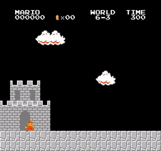

## Mario with Q-Learning

### Level 1-1

### Level 1-2

### Level 1-3
TODO - current model doesn't seem to beat this level. It could be related
to the need for more exploration to avoid the density of pitfalls
at the beginning

### Level 1-4

### Level 2-1
TODO - Almost completes this level, but has trouble with the end spring

### Level 2-2

### Level 2-3

### Level 2-4

### Level 3-1

### Level 3-2

### Level 3-3

### Level 3-4

### Level 4-1

### Level 4-2

### Level 4-3
TODO - Failed at this level

### Level 4-4
TODO - Failed at this level

### Level 5-1

### Level 5-2

### Level 5-3
TODO - Failed at this level

### Level 5-4

### Level 6-1

### Level 6-2
TODO - Failed at this level

### Level 6-3

### Level 6-4

### Level 7-1
